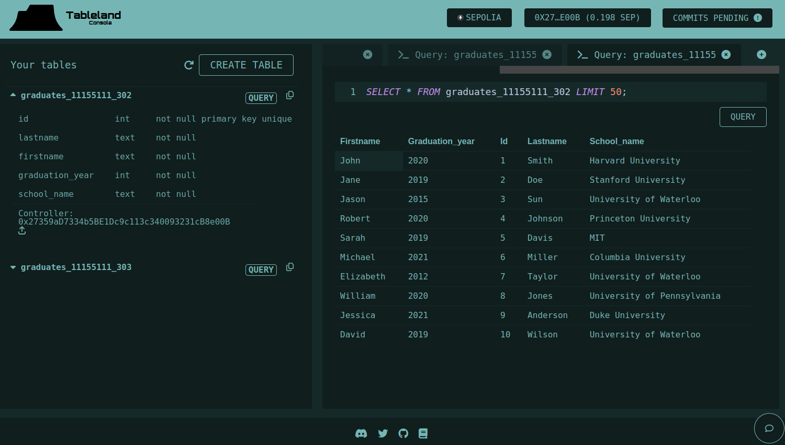

# 🌌 Memories

## 🌟 Overview

Memories is a web3 platform to create your personal side-chain to store verifyable and modifiable data on the blockchain. The database content itself is secured on the IPFS.

## 🌍 Use Cases

Imagine graduating from school and you have a list of all your classmates and something that changes, such as their reputation score. You want to store this list on the blockchain so it can be verifiable, but you also want to be able to modify it.

## ❓ Problem

In many systems, lists or databases (like event attendees or alumni) are neither permanent nor easily verifiable. This lack of transparency and permanence can lead to trust issues and data disputes. We want to know if Jason is a graduate from the class of 2020, but we also want to know if he is a good person by checking his reputation.

## ✨ Solution

The school can create a database of all the students and their reputation scores. This database can be publicly accessible and verifiable on the blockchain. However, the school can also modify the reputation scores of the students. This is where Memories comes in.

1. Use any SQL database for the data, such as using Tableland decentralized database system.
1. Modify the data in the database and update the smart contract with new hash.
1. Quickly check against smart contract the integrity of the data in the database.
1. Anyone can query for hashes on the blockchain which verifies off-chain database content.

Memories offers a multi-layered solution:

1. Data Storage: Utilize Tableland's decentralized database system, securing data lists such as event attendees.
1. Verifiability: Store these databases on IPFS through Filecoin, guaranteeing availability and redundancy.
1. Blockchain Integration: Deploy the database verification hash on a side chain that integrates seamlessly with Ethereum, thanks to its construction on the EVM. This is made scalable and efficient with Scroll's zero-knowledge rollup.
1. Data Privacy: Leverage Sismo Connect's zero-knowledge proof system, allowing data owners to prove membership or other attributes without revealing the actual data.
1. On-chain Queries: Query registry of hashes on the blockchain that represents off-chain database content hash. This ensures data immutability and allows anyone to verify the integrity of the data by comparing the off-chain data's hash with what's recorded on-chain.

## 🏗️ Technology Stack

- Database: Tableland decentralized database on EVM chains.
- Storage: IPFS on Filecoin for decentralized and verifiable storage.
- Blockchain & Execution: Scroll's next-generation zk-rollup ensures efficient and secure transaction execution.
- Data Privacy & Verification: Sismo Connect for zero-knowledge proofs and data aggregation.
- Frontend: React.js for the frontend.
- Backend: Node.js for the backend.
- Indexing: The Graph, for indexing and querying the blockchain.

## 🏆 Achievements

1. Deployed using Tableland Studio with data tables defining event attendees and graduates. (Qualifying for Prize #1)
1. Integrated Sismo Connect for data privacy and proof functionalities.
1. Built on Scroll's Sepolia Testnet ensuring compatibility with existing Ethereum toolsets.
1. Used Filecoin for robust decentralized storage of our databases.

## 🔗 Quick Links

1. Project Deployment: Link to deployed project
1. Database Viewer: Link to Tableland Studio project
1. Documentation: Link to detailed documentation
1. Video: Link to video demo

## Misc. Notes

### Scroll Challenge Submission Details

- ✅ Project contracts must be deployed on Scroll Sepolia and verified on the Scroll Etherscan.
- ✅ Project must have a working flow
- ✅ Project that excite us, include some of the following:
  - 🔍 Solve a tangible problem or build a relevant use usecase
  - 🔧 Provide value to developers/community in terms of public good

### 🔗 Project Links

#### scrollSepolia network

- 📝 deployed "MemoriesDataHashRegistry" (tx: 0xc5a3f0dc89e707d51929d102e56b8dd2eb03f49cd7a5cd3e8041d08f4a151d40)...: deployed at [0x27070757df870B10eCE7605c9B7985665393F7De](https://sepolia.etherscan.io/address/0x27070757df870b10ece7605c9b7985665393f7de)
- https://sepolia.scrollscan.dev/address/0x27070757df870b10ece7605c9b7985665393f7de

#### sepolia network

- 📝 deployed "MemoriesDataHashRegistry" (tx: 0x5d23c951d9fb2354a5a8d75278c7930fd960973eb069ba6b071b559787d4fbd9)...: deployed at [0x074b3863DB516B8aAC65f8316130208eeBDb67e7](https://sepolia.etherscan.io/address/0x074b3863db516b8aac65f8316130208eebdb67e7)

#### 🔍 Video demo of Memories smart contract

[](demo/Memories%20Smart%20Contract.webm)

### Tableland Challenge Submission Details

#### Prize #1 Application

I'm thrilled to announce the successful deployment of my project on Tableland's decentralized cloud database via the **Tableland Studio web app**.

Build & deploy using the Studio: create an account, a project, define table(s), and deploy your app within the Tableland Studio web app. Bonus: use the Studio CLI tool to populate tables with data (import into deployed tables, write queries to explore, etc.). Be sure to share your Studio team name (top left corner of web UI) & dev address (top right corner) in the prize submission!

- ✅ **Build & Deploy Using the Studio**

  - ✅🔐 **Account Creation**: Successfully created an account 0x27359aD7334b5BE1Dc9c113c340093231cB8e00B on Tableland Studio.
  - ✅🎨 **Project Initiation**: Initiated a brand-new project https://studio.tableland.xyz/memories.
  - ✅📊 **Table Definition**: Defined the necessary table(s) https://studio.tableland.xyz/memories/memories/deployments/default/graduates `graduates_11155111_302`.
    - 🔍 Controller: 0x27359aD7334b5BE1Dc9c113c340093231cB8e00B
  - ✅🚢 **App Deployment**: Deployed the app using the Tableland Studio web app, using @tableland, NextJS, RainbowKit, Hardhat, Wagmi, and Typescript.

- ✅🎉 **Bonus Tasks**
  - ✅💻 **Studio CLI Tool Usage**:
    - ✅📤 **Data Population**: Imported data into deployed tables using SQLite queries:
    - ✅🔍 **Queries**: Wrote and executed queries to explore data.

Import data, [etherscan link](https://sepolia.etherscan.io/tx/0x61f7c662bd0a114c114ffa204670363eeb1fd66c2d37cd5c3560c2034a430fd2):

```sql
INSERT INTO graduates (id, lastname, firstname, graduation_year, school_name)
VALUES
(1, 'Smith', 'John', 2020, 'Harvard University'),
(2, 'Doe', 'Jane', 2019, 'Stanford University'),
(3, 'Sun', 'Jason', 2015, 'University of Waterloo'),
(4, 'Johnson', 'Robert', 2020, 'Princeton University'),
(5, 'Davis', 'Sarah', 2019, 'MIT'),
(6, 'Miller', 'Michael', 2021, 'Columbia University'),
(7, 'Taylor', 'Elizabeth', 2012, 'University of Waterloo'),
(8, 'Jones', 'William', 2020, 'University of Pennsylvania'),
(9, 'Anderson', 'Jessica', 2021, 'Duke University'),
(10, 'Wilson', 'David', 2019, 'University of Waterloo');
```

Query:

```sql
SELECT * FROM graduates_11155111_302 LIMIT 50;
```



- ✅📝 **Submission Details**
  - ✅🏷️ **Studio Team Name**: Shared the name displayed at the top-left corner of the web UI.
  - ✅🔖 **Developer Address**: Shared the address displayed at the top-right corner of the web UI.

### Project Title:

**Graduates**

### Project Link:

[graduates on Tableland Studio](https://studio.tableland.xyz/memories/memories/deployments/default/graduates)

## Features & Implementation

- Defined meticulous tables for the project.
- Utilized the **Studio CLI tool** to:
  - Populate the tables with relevant data.
  - Enable interactive exploration of the database.
