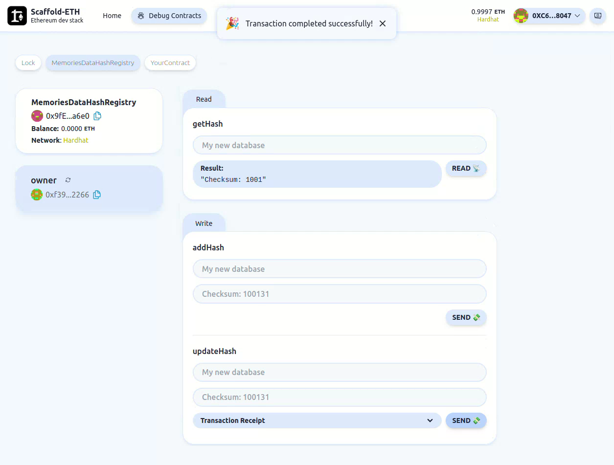

# 🌌 Memories

## 🌟 Overview

Memories allows individuals and organizations to create their personalized side chains and subsequently roll-up database hash verifications to the main blockchain. This architecture ensures that while the side chain data's lifecycle remains flexible (modifiable or deletable), the data's integrity remains verifiable on the main chain. The database content itself is secured on the IPFS network via Filecoin, ensuring decentralized, redundant, and verifiable storage.

## 🌍 Use Cases

Imagine having an unalterable yet verifiable list of event attendees, or a dynamic database of school graduates whose data can evolve (e.g., updated addresses, professional achievements) while maintaining traceability.

## ❓ Problem

In many systems, lists or databases (like event attendees or alumni) are neither permanent nor easily verifiable. This lack of transparency and permanence can lead to trust issues and data disputes.

## ✨ Solution

Memories offers a multi-layered solution:

1. Data Storage: Utilize Tableland's decentralized database system, securing data lists such as event attendees.
1. Verifiability: Store these databases on IPFS through Filecoin, guaranteeing availability and redundancy.
1. Blockchain Integration: Deploy the database verification hash on a side chain that integrates seamlessly with Ethereum, thanks to its construction on the EVM. This is made scalable and efficient with Scroll's zero-knowledge rollup.
1. Data Privacy: Leverage Sismo Connect's zero-knowledge proof system, allowing data owners to prove membership or other attributes without revealing the actual data.
1. On-chain Queries: Query registry of hashes on the blockchain that represents off-chain database content hash. This ensures data immutability and allows anyone to verify the integrity of the data by comparing the off-chain data's hash with what's recorded on-chain.

## 🏗️ Technology Stack

- Database: Tableland decentralized database on EVM chains.
- Storage: IPFS on Filecoin for decentralized and verifiable storage.
- Blockchain & Execution: Scroll's next-generation zk-rollup ensures efficient and secure transaction execution.
- Data Privacy & Verification: Sismo Connect for zero-knowledge proofs and data aggregation.
- Frontend: React.js for the frontend.
- Backend: Node.js for the backend.
- Indexing: The Graph, for indexing and querying the blockchain.

## 🏆 Achievements

1. Deployed using Tableland Studio with data tables defining event attendees and graduates. (Qualifying for Prize #1)
1. Integrated Sismo Connect for data privacy and proof functionalities.
1. Built on Scroll's Sepolia Testnet ensuring compatibility with existing Ethereum toolsets.
1. Used Filecoin for robust decentralized storage of our databases.

## 🔗 Quick Links

1. Project Deployment: Link to deployed project
1. Database Viewer: Link to Tableland Studio project
1. Documentation: Link to detailed documentation
1. Video: Link to video demo

### Misc. Notes

#### scrollSepolia network

- 📝 deployed "MemoriesDataHashRegistry" (tx: 0xc5a3f0dc89e707d51929d102e56b8dd2eb03f49cd7a5cd3e8041d08f4a151d40)...: deployed at [0x27070757df870B10eCE7605c9B7985665393F7De](https://sepolia.etherscan.io/address/0x27070757df870b10ece7605c9b7985665393f7de)
- https://sepolia.scrollscan.dev/address/0x27070757df870b10ece7605c9b7985665393f7de

#### sepolia network

- 📝 deployed "MemoriesDataHashRegistry" (tx: 0x5d23c951d9fb2354a5a8d75278c7930fd960973eb069ba6b071b559787d4fbd9)...: deployed at [0x074b3863DB516B8aAC65f8316130208eeBDb67e7](https://sepolia.etherscan.io/address/0x074b3863db516b8aac65f8316130208eebdb67e7)

#### Video demo of Memories smart contract

